# GoAndroid-PetApi

The project was created to improve programming skills in both Kotlin (android, Clean MVVM Architecture, Jetpack Compose) and GO (Fiber, GORM, Viper). 
The application is REST type, it allows user to create, read, update and delete data of pets from the database over API. There is also an animated splash screen. In addition, the entire application supports a dark and light mode.  
<b>Android</b> The project uses Uncle Bob's <b> MVVM Clean Architecture</b> in order to provide more readable, testable, scalable, understandable and maintainable code.  
The application uses the latest technologies: <b>Jetpack Compose, Coil, Coroutines, Flow, Retrofit, Google's Accompanist Swipe Refresh</b> and <b> Dagger - Hilt </b> as dependency injection.   
To create the API, I used the Go language with <b>Fiber</b>, <b>Viper</b> and <b>GORM</b> as connection to <b>PostgreSQL database</b>.   

## Table of contents:
* [Android](#android)
* [Go](#go)
* [Illustrations](#illustrations)

## Android
The Android part of the project uses:
* Clean MVVM Architecture
* Jetpack Compose
* Coil
* Retrofit
* Google's Accompanist Swipe Refresh
* Dagger - Hilt
* Kotlin Flows
* Kotlin Coroutines

## Go
The Golang part of the project uses:
* Fiber
* Viper
* GORM
* PostgreSQL

## Illustrations

 
 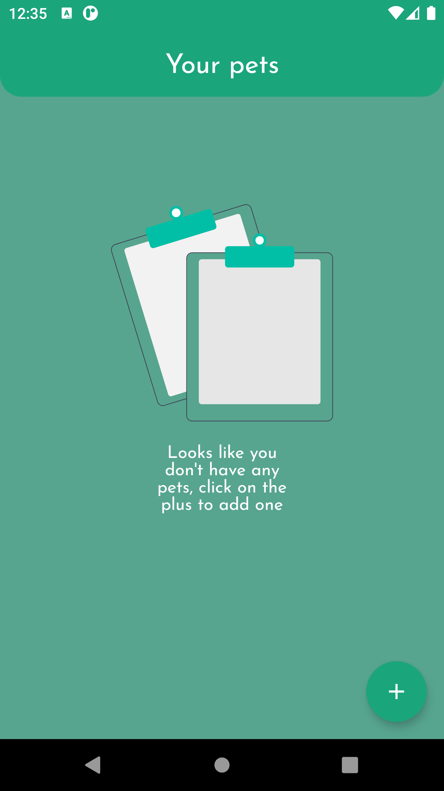
 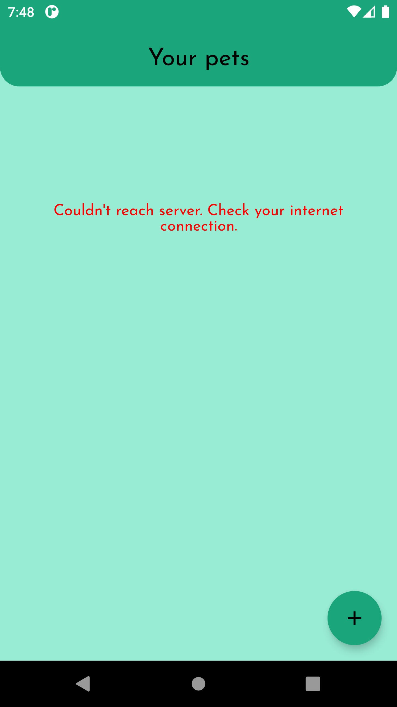
 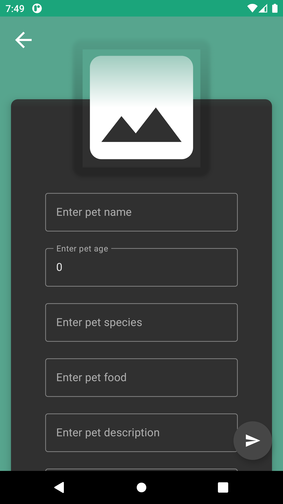
 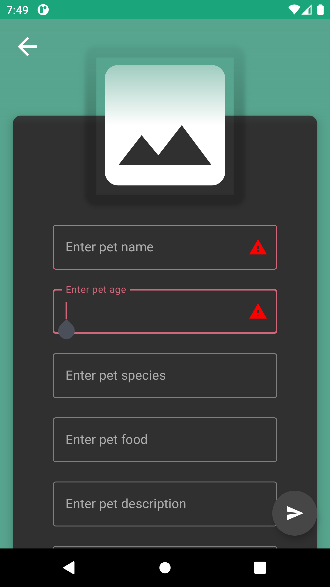
 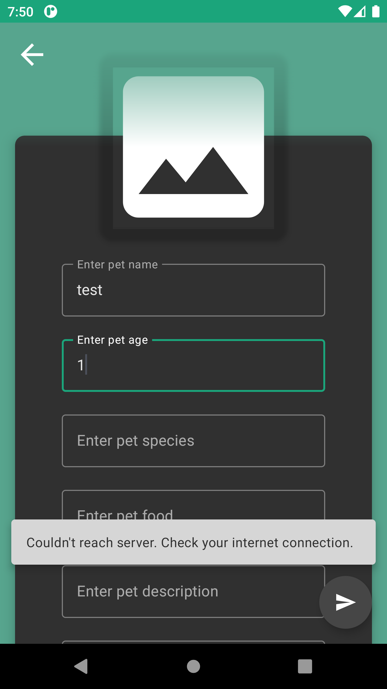
 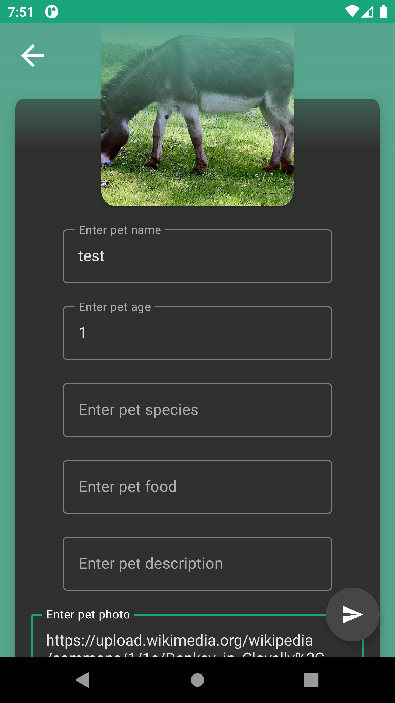
 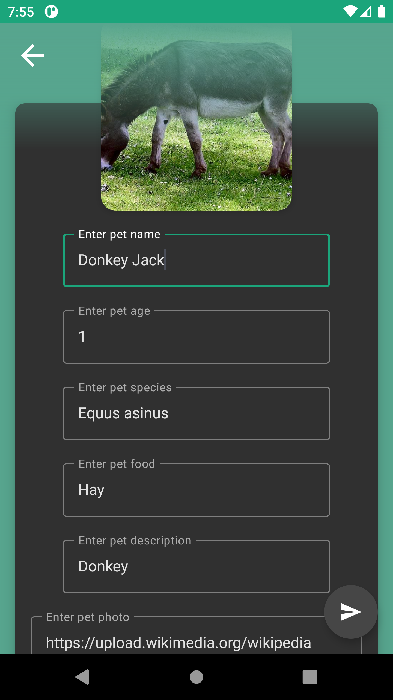
 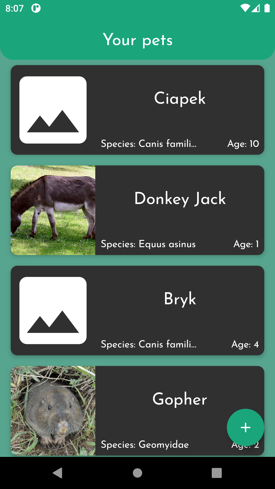
 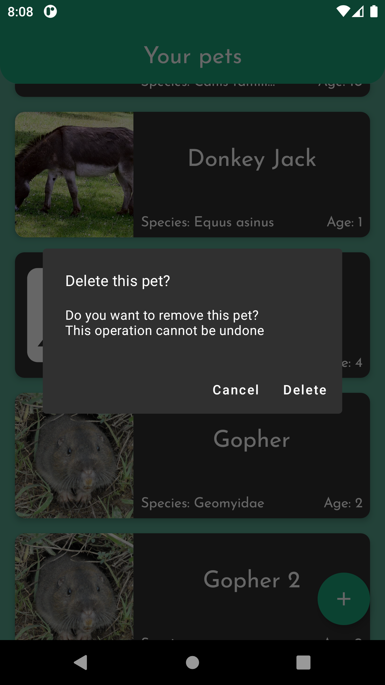
 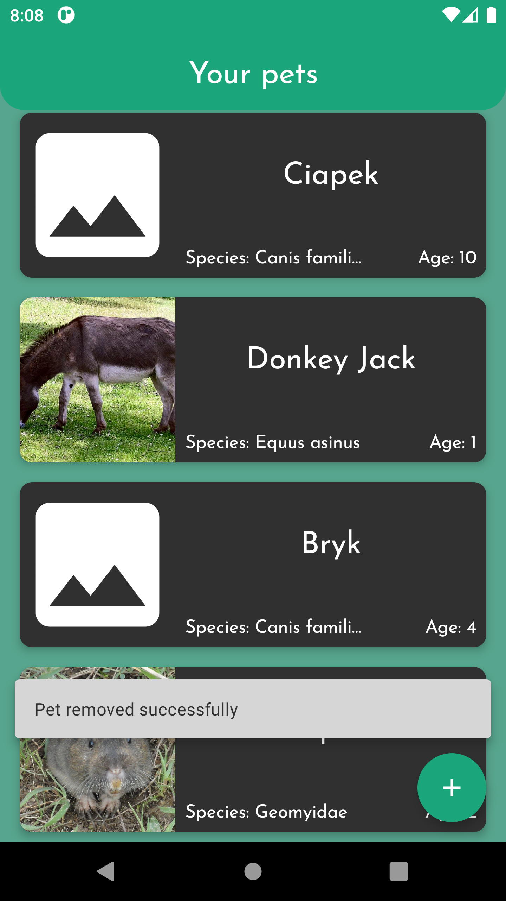
 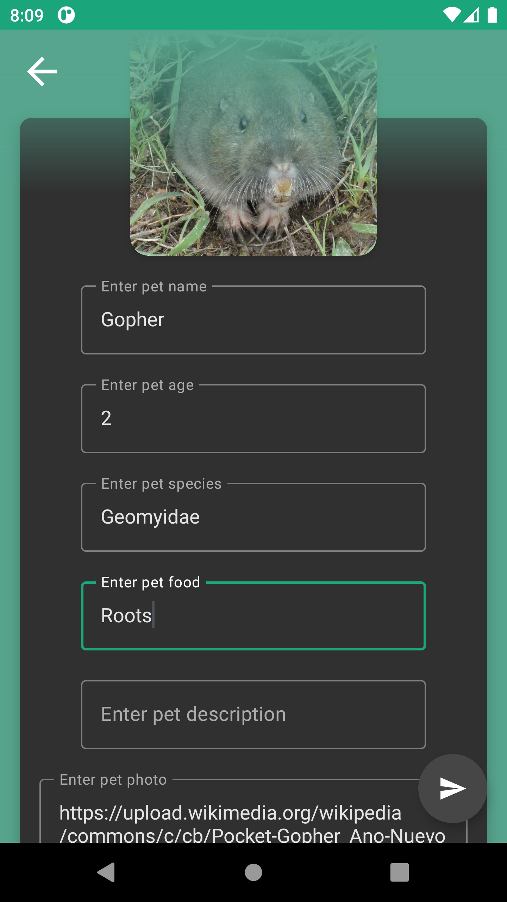
 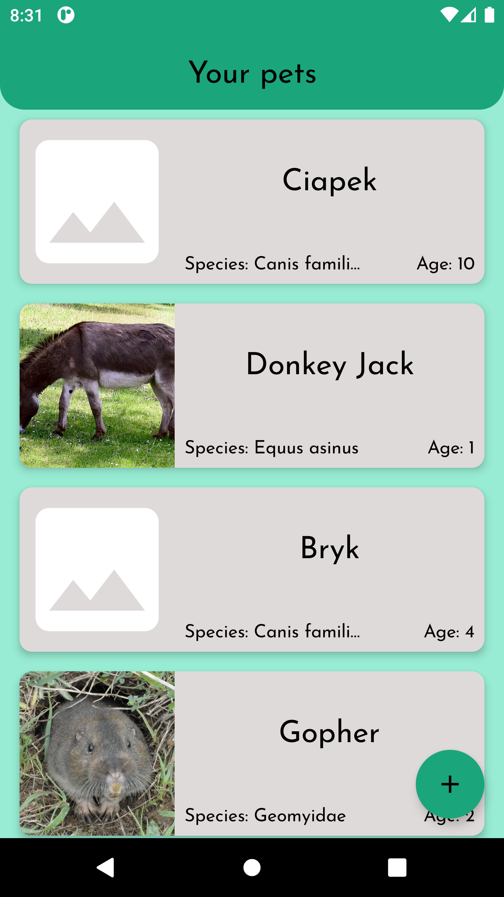
 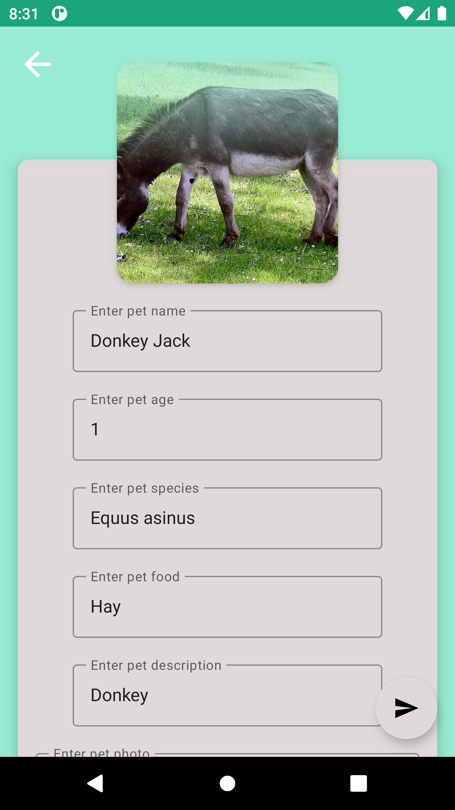
 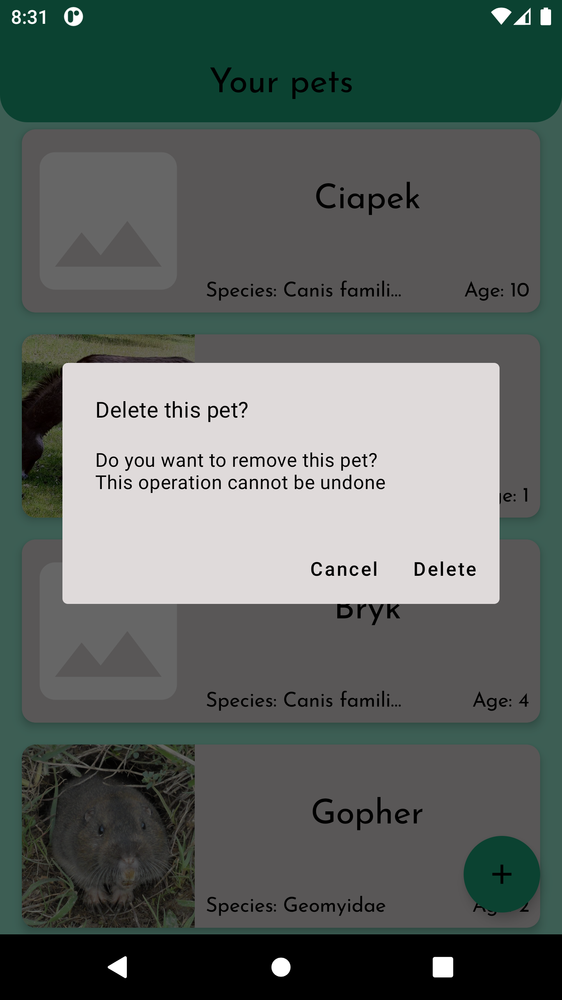

